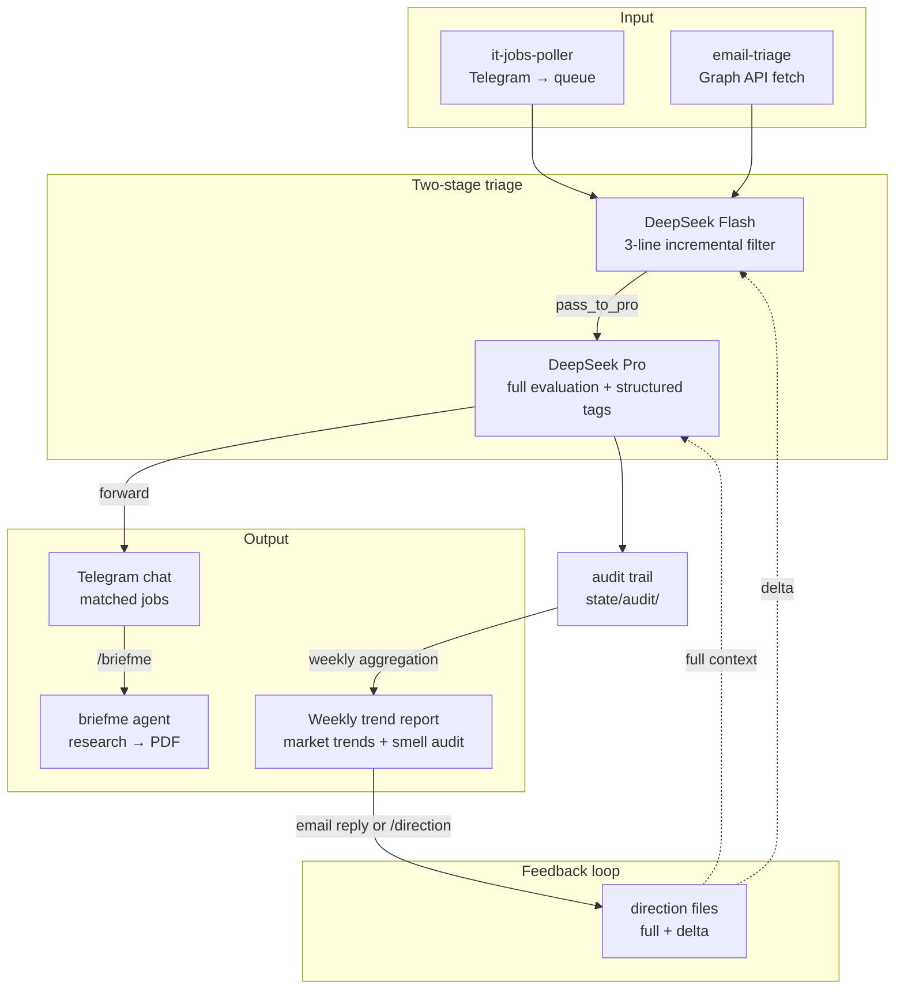

# telegram_MCP

[](https://github.com/mknull/tg-infra/actions/workflows/ci.yml)

A self-contained job-market intelligence pipeline. Monitors Telegram groups and Outlook inboxes, runs a two-stage DeepSeek triage to filter vacancies for relevance, delivers matches to a private Telegram chat, and adapts to user feedback over time. Built to run unattended under systemd.

## Architecture



## Pipeline detail

### Two-stage triage

Every message passes through Flash (`deepseek-v4-flash`) which reads 3 lines at a time and decides: `disqualified`, `read_more`, or `pass_to_pro`. Only messages Flash can't disqualify reach Pro (`deepseek-v4-pro`) for full body evaluation against the candidate's criteria. Most volume dies at Flash.

Pro extracts structured tags (role title, skills, domain, seniority, remote status) alongside the send/skip decision — the model already has the full text in context, so this costs nothing extra.

### Per-channel config, not per-channel code

Channel descriptions live in `state/channels.json` — each entry specifies what the channel is about, how messages are formatted, and what roles the user wants vs. will accept. The flash prompt is a fixed template; channel-specific values are interpolated at runtime. No channel-specific code paths.

### `/briefme` agent

A DeepSeek function-calling agent. The user quotes a job and replies `/briefme` — the agent loads profile files, searches for the company, fetches the listing, and produces a decision-grade brief covering the role, environment, and career-strategic fit. Output is converted to PDF and sent as a Telegram document.

Tools are guardrailed: URL validation with trusted-domain fast-path (unknown domains blocked), filesystem sandbox (`.resolve()` on every path), query injection detection, content sanitisation with closing-tag stripping, and a per-brief rate limiter. 34 adversarial tests verify each layer fails closed.

### Adaptive direction

The user's profile is generated once from documents, but preferences drift. A `CurrentDirection` file captures deltas ("exploring comp bio," "skip data engineering roles"). The weekly report prompts for corrections. When the user replies or sends `/direction` to the bot, the direction file updates, and both Flash and Pro see the delta in their prompts. Behavior changes without manual prompt editing.

### Audit discipline

Every decision across every pipeline is recorded to `state/audit/`. The `./audit` CLI surfaces:

- **Default view** — recent records with inline duplicate warnings
- **`--summary`** — per-source stats (records vs unique, decision distributions)
- **`--topology`** — expected vs actual cascade paths with deviation detection
- **`--health`** — exits 1 on duplicate evals, broken cascades, direction sync issues, prompt size bloat, delivery failures, agent errors

The audit found the cursor precision bug, the false-positive minute-granularity issue, and the broken cascade from the pre-fix duplicate runs — each before the user noticed them in production.

### Web search isolation

The agent's `web_search` targets a self-hosted [SearXNG](https://github.com/searxng/searxng) instance in Docker, bound to `127.0.0.1`. No third-party search API, no API keys, no rate limits. The agent's filesystem sandbox can't reach it directly — only the `web_search` tool function can.

## Project structure

```
├── lib/                    config, api, delivery, direction, auth, audit, graph, log, onboarding, seen, state, weekly_ledger
├── guardrails.py           Agent tool access control
├── tools.py                Agent tools (read_file, web_search, web_fetch, md_to_pdf)
├── agent.py                DeepSeek function-calling loop + system prompt
├── audit                   CLI audit tool
│
├── it-jobs-poller.py       Telethon poller (Telegram groups → queue)
├── it-jobs-triage.py       Queue → incremental Flash → Pro → delivery
├── email-triage.py         Outlook Graph API → Flash → Pro → delivery
├── email-ingest-wrap       Email ingest + audit health check + Telegram alert
│
├── bot-commands.py         Telegram bot (/briefme, /direction, /start, /status)
├── weekly-trend.py         Weekly market report + smell investigation
├── weekly-recovery.py      Retries the weekly report until confirmed sent
├── outlook-auth.py         One-time Outlook OAuth device-code flow
├── feedback-poller.py      Polls Outlook for replies to weekly reports
├── generate-profile.py     Two-stage profile generation from user documents
│
├── setup.sh                Installer (systemd unit generation)
├── setup-verify.py         Verifies an install is configured + delivering
├── delivery-canary.py      Synthetic message through the real deliver() path
│
├── state/                  Runtime state (cursors, audit, queue, config, tokens)
├── state/channels.json     Per-channel descriptions, desired/acceptable roles
├── channels.json.example   Seed for state/channels.json on a clean checkout
├── source/                 Profile inputs (interests, skills, tech_stack)
├── tests/                  242 tests across 21 files (unittest)
│
├── .github/workflows/ci.yml  CI: run 242 tests + audit health check
└── requirements.txt        telethon, markdown, weasyprint, playwright
```

## Dependencies

- Python ≥ 3.10, a single venv, four pip packages
- DeepSeek API (flash + pro models)
- Microsoft Graph API (Outlook email — optional)
- Telethon (Telegram MTProto user-API)
- SearXNG (self-hosted metasearch, Docker)
- systemd (user timers, no root)

No LangChain. No hosted scrapers. No proprietary search APIs.
