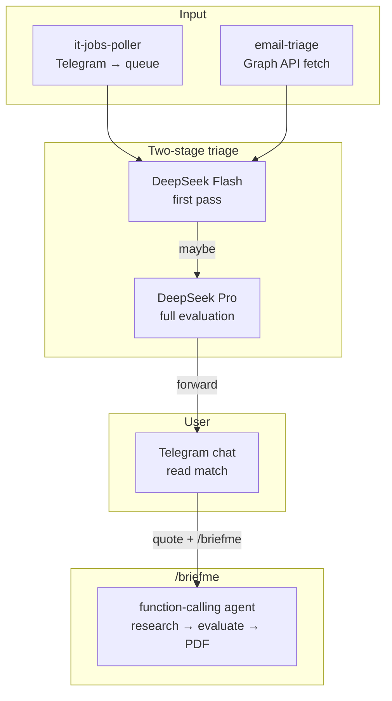

# telegram_MCP

A self-contained job-market intelligence pipeline. Monitors Telegram groups, Outlook inboxes, and recruitment sites — runs a two-stage DeepSeek triage to filter vacancies for relevance — delivers decision-grade briefs to a private Telegram chat. Built to run unattended under systemd with no third-party services.

## Architecture



## Pipeline detail

### Two-stage triage (email and Telegram)

Every message passes through a **Flash** model (deepseek-v4-flash, fast and cheap) that filters obvious mismatches — wrong domain, CV posted instead of a vacancy, non-technical roles. Messages that pass Flash get full body evaluation from a **Pro** model (deepseek-v4-pro) against Filippos Panagiotou's profile criteria. Matches are forwarded to Telegram with a structured summary.

The cursor-based dedup (`receivedDateTime gt {cursor + 1s}`) prevents the Graph API's sub-second timestamp precision from creating infinite re-processing loops — a bug the audit tool caught and the pipeline self-heals from.

### `/briefme` agent

A DeepSeek function-calling agent that replaces the old single-pass prompt. When the user quotes a job posting and replies `/briefme`, the agent loads his profile files, searches for the company, fetches the listing, and produces a decision-grade brief covering the role, environment, and career-strategic fit. Output is converted to PDF and sent as a Telegram document.

The agent operates with guardrailed tools: a two-stage URL validator (static blocklist → Flash classifier for unknown domains), filesystem sandbox (writes restricted to `workspace/briefs/`, reads to the project root), search query injection detection, and a per-brief rate limiter. 49 tests simulate adversarial tool calls trying to break each guardrail.

### Audit discipline

Every decision across every pipeline is recorded to `state/audit/`. The `./audit` CLI surfaces:

- **Default view** — recent records with inline duplicate warnings
- **`--summary`** — per-source stats (records vs unique, decision distributions)
- **`--topology`** — expected vs actual cascade paths with deviation detection
- **`--health`** — machine-readable check that exits 1 on duplicate evals, broken cascades, agent failures, or tool errors (designed to run after every email-ingest cycle)

The audit found the cursor precision bug, the false-positive minute-granularity issue, and the broken cascade from the pre-fix duplicate runs — each fixed before the user noticed them in production.

### Guardrails

All agent tool access is gated through `guardrails.py`: fetch URL validation (scheme blocks, internal IP blocks, trusted domain fast-path, Flash classifier for unknowns), search query injection detection, filesystem sandbox (`.resolve()` on every path), content sanitisation (wraps fetched text in isolation tags), and a per-brief rate limiter. 27 adversarial tests verify each layer fails closed.

## Project structure

```
├── lib.py                  Shared utilities (env, DeepSeek, Telegram, audit)
├── guardrails.py           Agent tool access control
├── tools.py                Agent tools (read_file, web_search, web_fetch, md_to_pdf)
├── agent.py                DeepSeek function-calling loop + system prompt
├── audit                   CLI audit tool
│
├── email-triage.py         Outlook → Flash → Pro → Telegram
├── email-ingest-wrap       Email ingest + audit health check + Telegram alert
│
├── it-jobs-poller.py       Telethon poller (Telegram groups → queue)
├── it-jobs-triage.py       Queue → Flash → Pro → Telegram
│
├── bot-commands.py         Telegram bot command handler (/briefme, /start, /status)
│
├── skills/job-brief/       /briefme skill doc + references
├── source/                 Filippos's profile (interests, skills, tech_stack)
├── state/                  Runtime state (cursors, audit, queue, logs, tokens)
│
├── test_guardrails.py      27 adversarial tests
├── test_tools.py           14 tool tests
├── test_agent.py           8 agent loop tests
│
└── requirements.txt        telethon, markdown, weasyprint, playwright
```

## Dependencies

- Python ≥ 3.10, a single venv, four pip packages
- DeepSeek API (flash + pro models)
- Microsoft Graph API (Outlook email)
- Telethon (Telegram MTProto user-API)
- systemd (user timers, no root)

No LangChain. No hosted scrapers. No third-party APIs beyond the three the pipeline targets.
